# 🏗️ Vector Storage Provider Pattern

This document explains the **Provider Pattern** implementation for vector storage in the Mastra Finance AI project, focusing on local development with SQLite and testing with Mock providers.

## 📁 **File Structure**

```
src/mastra/tools/account-statement/providers/
│
├── base.ts                    # 🏛️ Base interfaces and types
├── factory.ts                 # 🏭 Provider factory and selection logic
├── mock.ts                    # 🎭 Mock provider for testing
├── sqlite.ts                  # 📁 SQLite provider for local development
└── vector-storage.ts          # 📦 Main export file
```

## 🎯 **Core Philosophy**

The Provider Pattern allows the application to seamlessly switch between different vector storage backends without changing the core business logic:

- **Development**: Use SQLite for reliable local storage
- **Testing**: Use Mock provider for fast, predictable tests
- **Flexibility**: Easy to add new providers in the future

## 🔧 **Environment Configuration**

```bash
# Force SQLite provider (recommended)
VECTOR_STORAGE_MODE=sqlite

# Force Mock provider (testing)
VECTOR_STORAGE_MODE=mock

# Auto-detection (defaults to SQLite)
VECTOR_STORAGE_MODE=auto
```

## 🏛️ **Base Architecture**

### **VectorStorageProvider Interface**

```typescript
interface VectorStorageProvider {
  name: string;
  isAvailable(): boolean;
  insert(vectors: VectorRecord[]): Promise<{ mutationId: string }>;
  search(queryVector: number[], options?: VectorSearchOptions): Promise<VectorSearchResult[]>;
}
```

## 🏭 **Provider Implementations**

### **SQLiteProvider**
- **File**: `providers/sqlite.ts`
- **Use Case**: Local development and production
- **Features**: 
  - Real vector similarity calculations
  - Persistent storage in SQLite database
  - Full transaction metadata support
  - Cosine similarity search

### **MockVectorProvider**
- **File**: `providers/mock.ts`
- **Use Case**: Testing and development fallback
- **Features**:
  - In-memory storage
  - Predictable mock data
  - Fast execution
  - No external dependencies

## 🚀 **Factory Logic**

The `createVectorStorageProvider()` function automatically selects the best provider:

```typescript
export function createVectorStorageProvider(): VectorStorageProvider {
  // 1. Check explicit mode setting
  if (ENV.vectorStorageMode === 'sqlite') {
    return new SQLiteProvider();
  }
  
  if (ENV.vectorStorageMode === 'mock') {
    return new MockVectorProvider();
  }
  
  // 2. Auto mode: prefer SQLite
  return new SQLiteProvider();
}
```

## 🔍 **Provider Selection Flow**

```mermaid
graph TD
    A[Start] --> B{VECTOR_STORAGE_MODE?}
    B -->|sqlite| C[Use SQLiteProvider]
    B -->|mock| D[Use MockProvider]
    B -->|auto| E[Use SQLiteProvider as default]
    
    C --> F[✅ SQLite Active]
    D --> G[🎭 Mock Active]
    E --> H[📁 Auto-detected SQLite]
```



## 📊 **Provider Comparison**

| Feature | SQLite | Mock |
|---------|--------|------|
| **Storage** | Persistent | In-memory |
| **Performance** | Fast | Very fast |
| **Similarity** | Real cosine similarity | Mock scores |
| **Development** | ✅ Recommended | ✅ Testing only |
| **Production** | ✅ Suitable | ❌ Not recommended |
| **Dependencies** | better-sqlite3 | None |

## 🧪 **Usage Examples**

### **Manual Provider Creation**

```typescript
import { SQLiteProvider, MockVectorProvider } from './providers/vector-storage';

// Direct provider instantiation
const sqliteProvider = new SQLiteProvider();
const mockProvider = new MockVectorProvider();

// Check availability
console.log(sqliteProvider.isAvailable()); // true
console.log(mockProvider.isAvailable());   // true
```

### **Factory Usage (Recommended)**

```typescript
import { createVectorStorageProvider } from './providers/factory';

// Automatic provider selection based on environment
const provider = createVectorStorageProvider();
console.log(`Using: ${provider.name}`);

// Insert vectors
await provider.insert(vectors);

// Search vectors
const results = await provider.search(queryVector, { topK: 5 });
```

## 🔧 **Development Workflow**

### **1. Local Development**
```bash
VECTOR_STORAGE_MODE=sqlite npm run dev
# Uses SQLite for persistent local storage
```

### **2. Testing**
```bash
VECTOR_STORAGE_MODE=mock npm test
# Uses Mock provider for fast, predictable tests
```

### **3. Auto Mode**
```bash
npm run dev
# Automatically chooses SQLite as the best option
```

## 🎯 **Benefits**

- ✅ **Flexibility**: Easy to switch between storage backends
- ✅ **Testability**: Mock provider for reliable testing
- ✅ **Performance**: SQLite provides fast local storage
- ✅ **Simplicity**: Automatic provider selection
- ✅ **Maintainability**: Clean separation of concerns
- ✅ **Local Development**: No external dependencies required

## 📈 **Future Extensions**

The provider pattern makes it easy to add new storage backends:

```typescript
// Future providers could include:
class PostgreSQLProvider implements VectorStorageProvider { ... }
class RedisProvider implements VectorStorageProvider { ... }
class FileSystemProvider implements VectorStorageProvider { ... }
```

This architecture ensures the application remains flexible and maintainable as requirements evolve. 