# 🏗️ Vector Storage Provider Pattern

This document explains the new modular provider pattern architecture for vector storage in the Mastra Finance AI project.

## 📁 Architecture Overview

```
src/mastra/
├── config/
│   └── environment.ts              # 🆕 Environment detection & configuration
└── tools/account-statement/
    ├── providers/
    │   ├── base.ts                  # 🆕 Base interfaces & types
    │   ├── cloudflare-vectorize.ts  # 🆕 Cloudflare Vectorize provider
    │   ├── mock.ts                  # 🆕 Mock provider for development
    │   ├── factory.ts               # 🆕 Environment-aware provider factory
    │   └── vector-storage.ts        # ✅ Main export file (re-exports)
    ├── transaction-analyzer.ts      # ✅ Updated to use providers
    ├── vector-search.ts            # ✅ Updated to use providers
    └── index.ts                    # ✅ Updated exports
```

## 🎯 Key Benefits

### ✅ **Separation of Concerns**
- Each provider in its own file
- Clear interfaces and contracts
- Business logic separated from storage logic

### ✅ **Environment-Aware**
- Automatic detection of development vs production
- Smart provider selection based on environment
- Override capabilities via environment variables

### ✅ **Easy Extension**
- Add new vector databases by implementing `VectorStorageProvider`
- No changes needed to existing tools
- Plug-and-play architecture

### ✅ **Type Safety**
- Full TypeScript interfaces
- Consistent metadata structure
- Compile-time error checking

## 🔧 Environment Configuration

### **Automatic Detection**
The system automatically detects the environment based on:

```typescript
// Development indicators
- NODE_ENV === 'development'
- process.argv.includes('dev')
- MASTRA_DEV === 'true'
- HOSTNAME === 'localhost'
- VERCEL_ENV === 'development'

// Production indicators  
- NODE_ENV === 'production'
- Cloudflare Workers globals (caches, Request)
- CF_PAGES_BRANCH !== 'preview'
```

### **Manual Override**
Set environment variables to override automatic detection:

```bash
# Force mock provider (useful for testing)
VECTOR_STORAGE_MODE=mock

# Force Cloudflare provider (production)
VECTOR_STORAGE_MODE=cloudflare

# Auto-detection (default)
VECTOR_STORAGE_MODE=auto
```

## 🏭 Provider Implementations

### **CloudflareVectorizeProvider**
- **File**: `providers/cloudflare-vectorize.ts`
- **Use Case**: Production deployment on Cloudflare Workers
- **Features**: 
  - Real vector similarity search
  - Advanced filtering capabilities
  - Metadata indexing
  - High performance

### **MockVectorProvider**
- **File**: `providers/mock.ts`
- **Use Case**: Local development and testing
- **Features**:
  - In-memory vector storage
  - Cosine similarity calculation
  - Mock data generation
  - No external dependencies

## 🎮 Usage Examples

### **Basic Usage**
```typescript
import { createVectorStorageProvider } from './providers/factory';

// Automatically selects appropriate provider
const provider = createVectorStorageProvider(vectorDB);

// Insert vectors
await provider.insert([{
  id: 'transaction_123',
  values: embedding,
  metadata: { /* ... */ }
}]);

// Search vectors
const results = await provider.search(queryVector, {
  topK: 5,
  minScore: 0.7,
  filters: { category: 'food_beverage' }
});
```

### **Environment Information**
```typescript
import { getProviderInfo, ENV } from './providers/factory';

console.log('Environment:', ENV.environment);
console.log('Is Development:', ENV.isDevelopment);
console.log('Vector Mode:', ENV.vectorStorageMode);

const info = getProviderInfo(vectorDB);
console.log('Recommended Provider:', info.recommendedProvider);
console.log('Available Providers:', info.availableProviders);
```

### **Environment Logging**
```typescript
import { envLog } from '../../config/environment';

envLog('Processing transaction analysis');        // Info
envLog('Provider fallback activated', 'warn');    // Warning
envLog('Vector storage failed', 'error');         // Error
```

## 🧪 Testing

### **Local Development**
```bash
npm run dev
# 🔧 [DEV] Using MockVector for local development
```

### **Production Deployment**
```bash
wrangler deploy
# 🚀 [PROD] Using CloudflareVectorize (auto-detected)
```

### **Force Mock Mode**
```bash
VECTOR_STORAGE_MODE=mock npm run dev
# 🔧 [DEV] Using MockVector (forced by VECTOR_STORAGE_MODE=mock)
```

## 🔮 Future Extensions

### **Adding New Providers**
1. Create new provider file: `providers/pinecone.ts`
2. Implement `VectorStorageProvider` interface
3. Add to factory selection logic
4. Export from `vector-storage.ts`

### **Example: Pinecone Provider**
```typescript
// providers/pinecone.ts
export class PineconeProvider implements VectorStorageProvider {
  name = 'Pinecone';
  
  constructor(private pineconeClient: any) {}
  
  isAvailable(): boolean {
    return this.pineconeClient && this.pineconeClient.apiKey;
  }
  
  async insert(vectors: VectorRecord[]): Promise<{ mutationId: string }> {
    // Pinecone implementation
  }
  
  async search(queryVector: number[], options?: VectorSearchOptions): Promise<VectorSearchResult[]> {
    // Pinecone implementation
  }
}
```

## 📊 Environment Detection Logic

```mermaid
flowchart TD
    A[Start Provider Selection] --> B{VECTOR_STORAGE_MODE set?}
    B -->|mock| C[Use MockProvider]
    B -->|cloudflare| D{Vectorize Available?}
    B -->|auto| E{Environment Detection}
    
    D -->|Yes| F[Use CloudflareProvider]
    D -->|No| G[Warn & Use MockProvider]
    
    E --> H{Cloudflare Vectorize Available?}
    H -->|Yes| I[Use CloudflareProvider]
    H -->|No| J[Use MockProvider]
    
    C --> K[🔧 MockVector Active]
    F --> L[🚀 CloudflareVectorize Active]
    G --> M[⚠️ Fallback to MockVector]
    I --> N[🚀 Auto-detected CloudflareVectorize]
    J --> O[🔧 Auto-fallback MockVector]
```



## 🎉 Migration Complete

Your vector storage system now features:

- ✅ **Clean Architecture**: Each provider in its own file
- ✅ **Environment Detection**: Automatic dev/prod detection
- ✅ **Smart Fallbacks**: Graceful degradation when services unavailable
- ✅ **Type Safety**: Full TypeScript support
- ✅ **Easy Testing**: Mock provider for development
- ✅ **Production Ready**: Cloudflare Vectorize integration
- ✅ **Future Proof**: Easy to add new vector databases

The provider pattern eliminates vendor lock-in and makes your vector storage layer truly modular and maintainable! 🎯